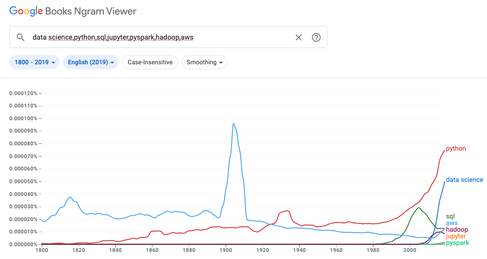

 
  

# Big Data Wrangling with Google Books Ngrams

## Table of Contents
- [About the Project](#about-the-project)
- [Prerequisites](#prerequisites)
- [The Data](#the-data)
  
## About the Project
The [Google Ngrams](https://books.google.com/ngrams) dataset was created by Google's research team by analyzing all of the content in Google Books - these digitized texts represent approximately 4% of all books ever printed, and span a time period from the 1800s into the 2000s.

In this workflow, I will filter and reduce a large dataset to a manageable size and then conduct local analysis on my machine after extracting and processing the data using Big Data tools. The process begins with setting up the environment and involves several key steps shown below:

First, I will spin up a new EMR cluster on AWS to utilize Spark and EMR notebooks. Once the cluster is set up, I will connect to the head node using SSH. After establishing the connection, I will copy the data folder from the S3 bucket directly into a directory on the Hadoop File System (HDFS).

Next, I will use PySpark to read the data copied into HDFS. Following this, I will create a new DataFrame from a Spark SQL query, filtering to include only the rows where the token is "data," and describe this new dataset. I will then write the filtered data back to a directory in HDFS and examine the contents of the written files.

After processing the data in the cloud, I will collect the contents of the directory into a single file on the local drive of the head node using getmerge. This file will then be moved into a S3 bucket in my account. On my local machine (or on AWS outside of Spark), I will read the CSV data from the S3 folder into a pandas DataFrame. 

Subsequently, I will use matplotlib to plot the number of occurrences of the token (the frequency column) over the years. This visual representation will help me understand the trends in the data over time.

## Prerequisites
**Language:** 
- Python

**Technology:**
- Amazon Web Services (AWS):
  - Elastic MapReduce (EMR): EMR is used to create a cluster for running big data frameworks like Hadoop and Spark.
  - S3 (Simple Storage Service): S3 is used for storing the dataset and saving the results after processing.
- Hadoop:
  - HDFS (Hadoop Distributed File System): HDFS is used to store the dataset within the EMR cluster.
getmerge: A Hadoop command used to merge files from HDFS into a single file.
- Spark:
  - PySpark: The Python API for Spark is used for reading, processing, and analyzing the dataset.
  - Spark SQL: Used for querying the dataset within Spark.
- Python:
  - pandas: Used for data manipulation and analysis on the local machine after extracting the processed data from the cloud.
  - matplotlib: A plotting library used to visualize the data locally.
- SSH:
  - SSH (Secure Shell): Used to connect to the head node of the EMR cluster for executing commands.

## The Data
The dataset is hosted in a public S3 bucket as part of the Amazon S3 Open Data Registry. For this assignment the data was converted to CSV and hosted on a public S3 bucket which may be accessed [here](http://brainstation-dsft.s3.ca-central-1.amazonaws.com/eng_1M_1gram.csv).
